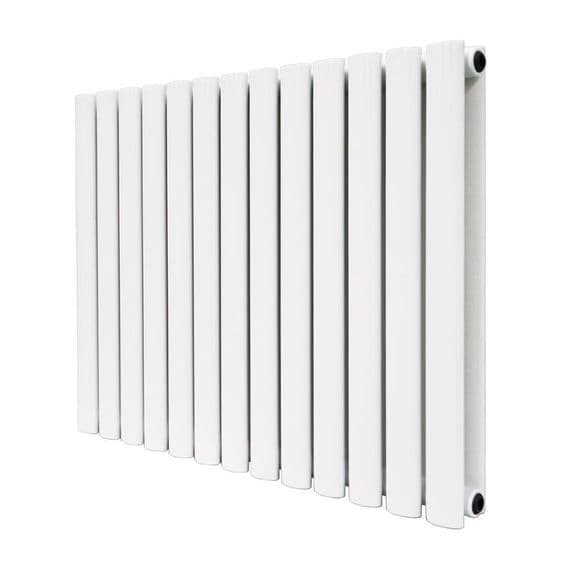
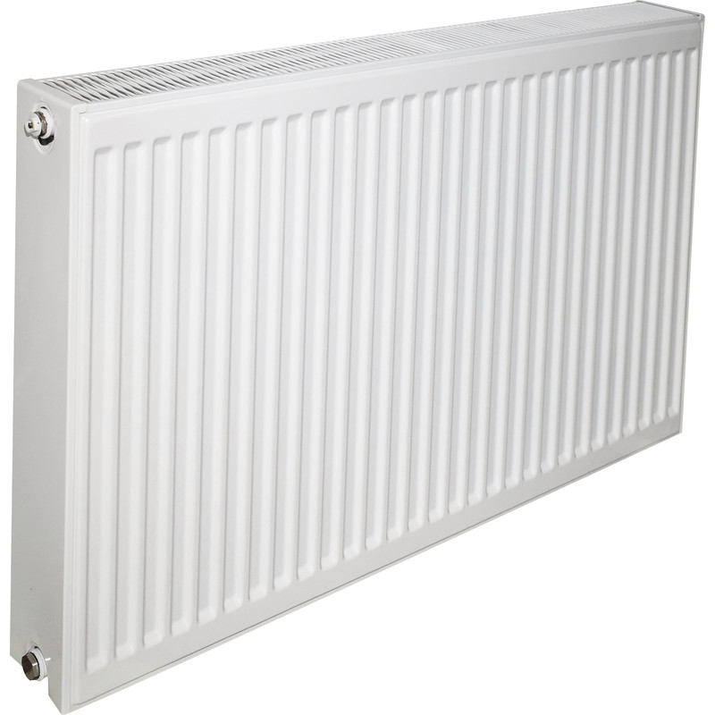

# Images

## A Red Circle

{width=30mm}

Above we can see an image of a red circle.



## Radiators

::: {layout-ncol=3}
{width=30mm}

{width=30mm}

{width=30mm}
:::

Above we can see many lovely looking radiators.