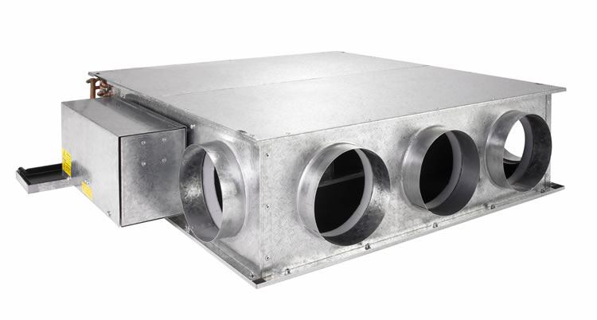
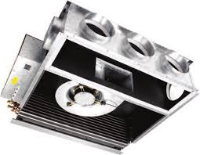
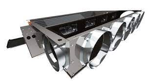

:::: {layout="[ 30, -5, 65 ]"}

::: {#first-column}
\addcontentsline{toc}{section}{Document Information}

\justifying \noindent \scriptsize __Max Fordham LLP__\                      
\                                         
maxfordham.com\                           
Max Fordham LLP is a Limited Liability\   
Partnership.\                             
\                                         
Registered in England and Wales\          
Number OC300026.\                         
\                                         
Registered office:\                       
42–43 Gloucester Crescent\                
London NW1 7PE\                           
This report is for the private and\       
confidential use of the clients for\      
whom the report is undertaken and\        
should not be reproduced in whole or\     
in part or relied upon by third parties\  
for any use whatsoever without the\       
express written authority of Max\         
Fordham LLP\                              
\                                         
© Max Fordham LLP\      
:::

::: {#second-column}
### Issue History
| date       | revision   | status code   | status description         | issue notes   |
|:-----------|:-----------|:--------------|:---------------------------|:--------------|
| 06 OCT 23  | C01        | S4            | Suitable for Stage Approval |               |
| 28 JUL 23  | 1          | S1            | Suitable for Coordination  |               |

: {tbl-colwidths="[20,10,10,30,30]"}

### Contributions
| name   | role             |      
|:-------|:-----------------|      
| BM     | Project Engineer |      

: {tbl-colwidths="[30,70]"}

### Notes
| index   | notes   |  
|---------|---------|  
| 1.      | Notes   |  

: {tbl-colwidths="[30,70]"}
:::

::::

\newpage
\toc
\newpage

## DX-O-1 - Fan Coil Units

_[\hyperlink{toc}{TOC}]_ Fan Coil Units - Pr_70_65_03_29

::: {layout-ncol=3}
{width=30mm}

{width=30mm}

{width=30mm}
:::

+------------------------------+----------------------------------------------+
| **Identity Data**            |                                              |
+==============================+==============================================+
| Abbreviation                 | DX-O                                         |
+------------------------------+----------------------------------------------+
| Type Reference               | 1                                            |
+------------------------------+----------------------------------------------+
| Uniclass Product Code        | Pr_70_65_03_29                               |
+------------------------------+----------------------------------------------+
| Uniclass Product Description | Fan coil units                               |
+------------------------------+----------------------------------------------+

: {tbl-colwidths="[30,70]"}

+----------------------+----------------------------------------------+
| **Dimensional Data** |                                              |
+======================+==============================================+
| Overall Length       | 285.0 _mm_                                   |
+----------------------+----------------------------------------------+
| Overall Width        | 765.0 _mm_                                   |
+----------------------+----------------------------------------------+
| Overall Height       | 550.0 _mm_                                   |
+----------------------+----------------------------------------------+
| Gross Weight         | 32.0 _kg_                                    |
+----------------------+----------------------------------------------+

: {tbl-colwidths="[30,70]"}

+------------------------+----------------------------------------------+
| **Performance Data**   |                                              |
+========================+==============================================+
| Cooling Output         | 3400.0 _W_                                   |
+------------------------+----------------------------------------------+

: {tbl-colwidths="[30,70]"}

+----------------------+----------------------------------------------+
| **Application Data** |                                              |
+======================+==============================================+
| Notes                | R32 refrigerant                              |
+----------------------+----------------------------------------------+
| Application          | Single Split DX outdoor unit, serving DX-I-2 |
+----------------------+----------------------------------------------+

: {tbl-colwidths="[30,70]"}

+---------------------+----------------------------------------------+
| **Electrical Data** |                                              |
+=====================+==============================================+
| Voltage             | 230.0 _V_                                    |
+---------------------+----------------------------------------------+
| Frequency           | 50.0 _Hz_                                    |
+---------------------+----------------------------------------------+

: {tbl-colwidths="[30,70]"}