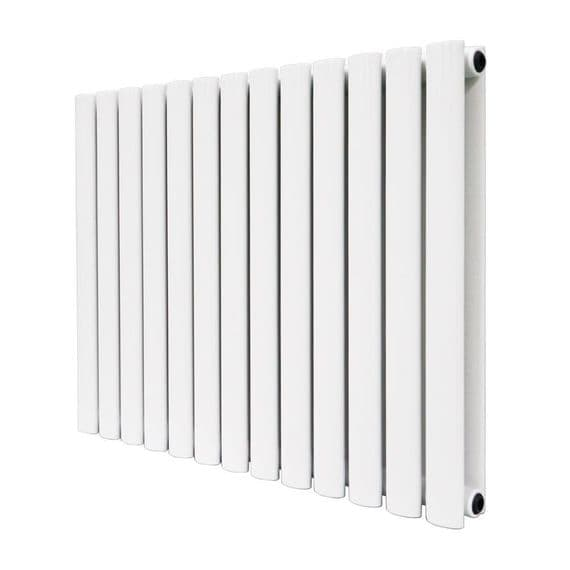

## Heading 2

### Heading 3

## Inline Text Formatting

**strong**, _emphasis_, `literal text`, \*escaped symbols\*

## Line Breaks

Fleas \
Adam \
Had 'em.

## Bullet points and numbered lists

- Lists can start with `-` or `*`
  - My other, nested
  - bullet point list!

1. My numbered list
2. has two points

By Strickland Gillilan



## Images

{width=30mm}

::: {layout-ncol=3}
{width=30mm}

{width=30mm}

{width=30mm}
:::



## Tables

| **foo**        | **bar**        |
|----------------|----------------|
| baz            | bim            |
| test test test | bim            |
| baz            | bim            |
| baz            | test test test |
| baz            | bim            |
| baz            | bim            |
| test test test | bim            |
| baz            | bim            |
| baz            | test test test |
| baz            | bim            |
| baz            | bim            |
| test test test | bim            |
| baz            | bim            |
| baz            | test test test |
| baz            | bim            |

: Sample grid table. {tbl-colwidths="[50,50]"}

+-----------+--------------------+
| **Fruit** | **Advantages**     |
+===========+====================+
| Bananas   | - built-in wrapper |
|           | - bright color     |
+-----------+--------------------+
| Oranges   | - cures scurvy     |
|           | - tasty            |
+-----------+--------------------+
| Bananas   | - built-in wrapper |
|           | - bright color     |
+-----------+--------------------+
| Oranges   | - cures scurvy     |
|           | - tasty            |
+-----------+--------------------+
| Bananas   | - built-in wrapper |
|           | - bright color     |
+-----------+--------------------+
| Oranges   | - cures scurvy     |
|           | - tasty            |
+-----------+--------------------+
| Bananas   | - built-in wrapper |
|           | - bright color     |
+-----------+--------------------+
| Oranges   | - cures scurvy     |
|           | - tasty            |
+-----------+--------------------+
| Bananas   | - built-in wrapper |
|           | - bright color     |
+-----------+--------------------+
| Oranges   | - cures scurvy     |
|           | - tasty            |
+-----------+--------------------+
| Bananas   | - built-in wrapper |
|           | - bright color     |
+-----------+--------------------+
| Oranges   | - cures scurvy     |
|           | - tasty            |
+-----------+--------------------+
| Bananas   | - built-in wrapper |
|           | - bright color     |
+-----------+--------------------+
| Oranges   | - cures scurvy     |
|           | - tasty            |
+-----------+--------------------+
| Bananas   | - built-in wrapper |
|           | - bright color     |
+-----------+--------------------+
| Oranges   | - cures scurvy     |
|           | - tasty            |
+-----------+--------------------+

: {tbl-colwidths="[30,70]"}
